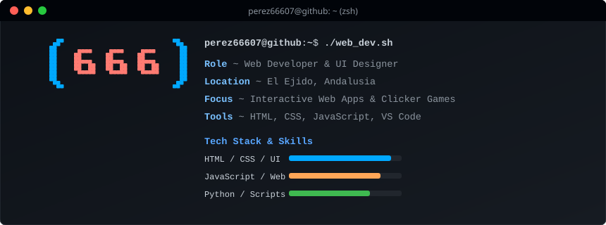

  
    
  

---

## 👨‍💻 Perfil Profesional & Enfoque

Desarrollador Web y Diseñador de Interfaces basado en **El Ejido, España**. Mi enfoque combina la precisión técnica en el desarrollo frontend con una sólida estructuración lógica orientada a la experiencia de usuario (UI/UX). Me especializo en convertir requerimientos complejos en aplicaciones web robustas, mantenibles y de alto rendimiento.

  
  
  
  
  
  
  

---

## 🏗️ Áreas de Especialización y Soluciones Web

| Área Tecnológica | Descripción y Enfoque Técnico |
| :--- | :--- |
| **Desarrollo Frontend & UI** | Creación de interfaces modernas, maquetación avanzada con HTML5 y CSS3, diseño adaptativo (Responsive Design) y estructuras semánticas limpias. |
| **Aplicaciones Web Interactivas** | Desarrollo de páginas web dinámicas (SPAs), gestión de estados orientados a eventos mediante JavaScript y construcción de paneles de control (Dashboards). |
| **Optimización & Rendimiento** | Refactorización de código, reducción de tiempos de carga, accesibilidad web (a11y) y buenas prácticas de optimización de recursos estáticos. |
| **Automatización & Scripting** | Desarrollo de scripts utilitarios en Python para procesamiento de datos, flujos de trabajo automatizados y sincronización continua de repositorios. |

---

## ⚙️ Arquitectura, Estándares y Buenas Prácticas

* **Estructura Modular**: Organización limpia de componentes de código para facilitar la escalabilidad y el mantenimiento a largo plazo.
* **Control de Versiones Profesional**: Uso estricto de flujos de trabajo con Git, control de ramas y commits descriptivos.
* **Integración Continua (CI/CD)**: Automatización de tareas rutinarias y despliegues mediante GitHub Actions para mantener los entornos sincronizados y actualizados.
* **Enfoque Centrado en el Usuario**: Diseño de interfaces intuitivas orientadas a la usabilidad, velocidad de respuesta y claridad visual.

---

## 📊 Estadísticas y Actividad en GitHub

  
  

---

  <i>🚀 Abierto a colaboraciones, proyectos web y retos de desarrollo frontend. ¡No dudes en explorar mis repositorios!</i>

