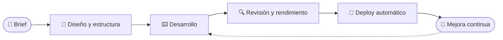

<div align="center">
  
</div>

<div align="center">
  <a href="https://perez66607.github.io/web_contacto_demo/" target="_blank">
    
  </a>
</div>

<p align="center">
  <a href="https://github.com/perez66607">
    
  </a>
</p>

<p align="center">
  
  
  
  
</p>

<p align="center">
  <a href="#-sobre-mí"><b>Sobre mí</b></a> &nbsp;·&nbsp;
  <a href="#-ahora-mismo"><b>Ahora</b></a> &nbsp;·&nbsp;
  <a href="#-habilidades"><b>Skills</b></a> &nbsp;·&nbsp;
  <a href="#-qué-hago"><b>Servicios</b></a> &nbsp;·&nbsp;
  <a href="#-proyectos"><b>Proyectos</b></a> &nbsp;·&nbsp;
  <a href="#-actividad"><b>Actividad</b></a> &nbsp;·&nbsp;
  <a href="#-contacto"><b>Contacto</b></a>
</p>


## 👋 Sobre mí

Soy desarrollador web y me muevo entre dos mundos: **lo que se ve** (interfaces limpias, accesibles y que funcionan en cualquier pantalla) y **lo que no se ve** (scripts y pipelines que automatizan el trabajo pesado).

Creo que un buen proyecto web se reconoce por tres cosas: **carga rápido**, **se entiende a la primera** y **es fácil de mantener**.

```jsonc
// perez66607.config.json
{
  "rol": "Web Developer",
  "base": "España 🇪🇸",
  "idiomas": ["Español (nativo)", "Inglés (técnico)"],
  "principios": [
    "Simple antes que ingenioso",
    "Mobile first, siempre",
    "Si se repite, se automatiza"
  ],
  "disponible": true
}
```


## 🎯 Ahora mismo

<table>
  <tr>
    <td width="25%" align="center" valign="top">
      <h3>🔨</h3>
      <b>Construyendo</b><br>
      <sub>Interfaces responsive y herramientas web a medida</sub>
    </td>
    <td width="25%" align="center" valign="top">
      <h3>📚</h3>
      <b>Aprendiendo</b><br>
      <sub>TypeScript, React y testing</sub>
    </td>
    <td width="25%" align="center" valign="top">
      <h3>🧪</h3>
      <b>Explorando</b><br>
      <sub>Automatización con Python y GitHub Actions</sub>
    </td>
    <td width="25%" align="center" valign="top">
      <h3>🤝</h3>
      <b>Abierto a</b><br>
      <sub>Proyectos freelance y colaboraciones</sub>
    </td>
  </tr>
</table>


## ⚡ Habilidades

<p align="center">
  
</p>

<p align="center">
  
</p>


## 🚀 Qué hago

<table>
  <tr>
    <td width="50%" valign="top">
      <h3>🎨 UI y maquetación</h3>
      HTML semántico, CSS moderno (Grid, Flexbox, variables) y diseño responsive pensado primero para móvil.
      <br><br>
      
      
    </td>
    <td width="50%" valign="top">
      <h3>⚙️ Apps web interactivas</h3>
      Interfaces dinámicas con JavaScript, paneles de control y flujos de usuario claros.
      <br><br>
      
      
    </td>
  </tr>
  <tr>
    <td width="50%" valign="top">
      <h3>⚡ Rendimiento</h3>
      Refactorización, código ligero y tiempos de carga mínimos para una experiencia fluida.
      <br><br>
      
    </td>
    <td width="50%" valign="top">
      <h3>🤖 Automatización</h3>
      Scripts en Python, pipelines con GitHub Actions y despliegues sincronizados.
      <br><br>
      
      
    </td>
  </tr>
</table>

### 🔄 Cómo trabajo




## 📌 Proyectos

<!-- Cambia TU_REPO_1 ... TU_REPO_4 por los nombres reales de tus repositorios -->
<table>
  <tr>
    <td width="50%">
      <a href="https://github.com/perez66607/TU_REPO_1">
        
      </a>
    </td>
    <td width="50%">
      <a href="https://github.com/perez66607/TU_REPO_2">
        
      </a>
    </td>
  </tr>
  <tr>
    <td width="50%">
      <a href="https://github.com/perez66607/TU_REPO_3">
        
      </a>
    </td>
    <td width="50%">
      <a href="https://github.com/perez66607/TU_REPO_4">
        
      </a>
    </td>
  </tr>
</table>


## 📊 Actividad

<p align="center">
  
  
</p>

<p align="center">
  
</p>

<p align="center">
  <picture>
    <source media="(prefers-color-scheme: dark)" srcset="https://raw.githubusercontent.com/perez66607/perez66607/output/github-snake-dark.svg" />
    <source media="(prefers-color-scheme: light)" srcset="https://raw.githubusercontent.com/perez66607/perez66607/output/github-snake.svg" />
    
  </picture>
</p>


## 📬 Contacto

¿Tienes una idea, una web que mejorar o algo que automatizar? Escríbeme.

<p align="center">
  <!-- Pon aquí el email que quieras hacer público (los perfiles de GitHub lo ve todo el mundo) -->
  <a href="mailto:TU_EMAIL@ejemplo.com">
    
  </a>
  <a href="https://github.com/perez66607">
    
  </a>
</p>

<p align="center">
  <sub><i>"Haz que funcione, haz que sea correcto, haz que sea rápido."</i> — Kent Beck</sub>
</p>

<p align="center">
  
</p>
